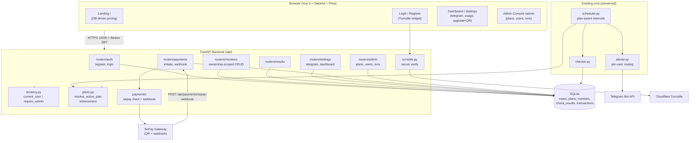
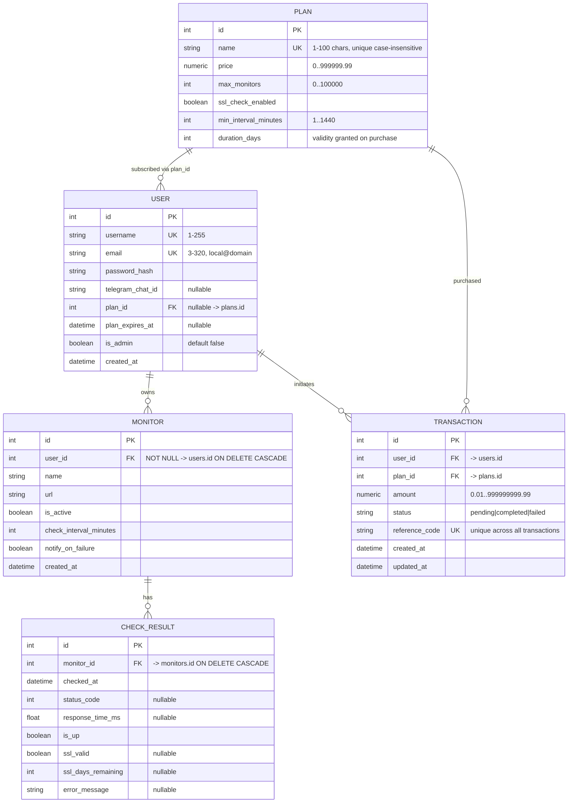
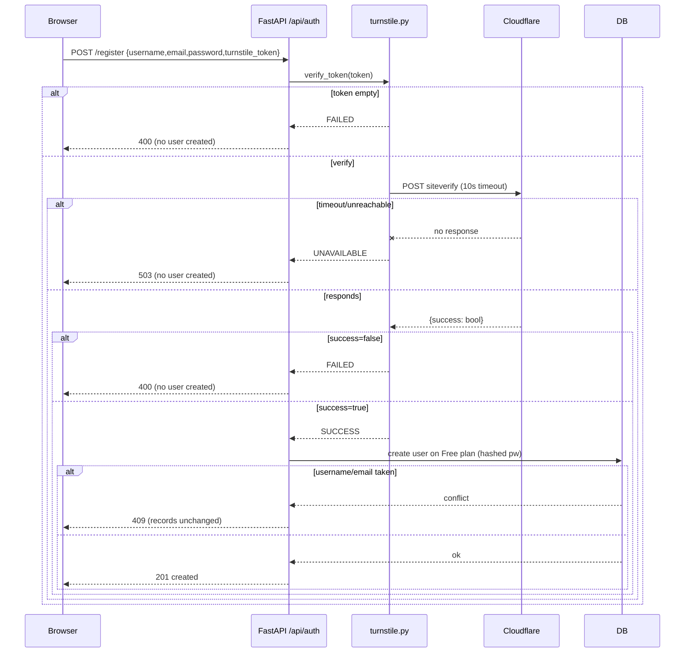

# Design Document

## Overview

This design refactors the existing single-user "Uptime Guardian" / NCMS Monitor application into a multi-tenant SaaS platform. The current system has one global `User`, a single global Telegram channel (`Settings.telegram_chat_id`), and unrestricted monitor creation. The refactor introduces:

- **Subscription plans** (`plans` table) defining price, monitor count limit, SSL feature gating, and minimum check interval.
- **Per-tenant data ownership** via `Monitor.user_id`, with ownership-scoped queries and 404-based isolation.
- **Plan enforcement**: monitor count limits (concurrency-safe), interval floors, SSL feature gating, and plan-aware scheduling.
- **Per-user Telegram alerting** keyed off each owning `Tenant_User.telegram_chat_id`.
- **Bot protection** via Cloudflare Turnstile on register/login.
- **Paid upgrades** via SePay (Vietnamese bank-transfer gateway) with QR payment initiation and a confirmation webhook.
- **Frontend**: a public landing page with DB-driven pricing, Turnstile-protected auth pages, a self-service dashboard, and an admin console.
- **A one-time data migration** that promotes the existing single-user database to the multi-tenant model.

The design deliberately preserves the existing module boundaries and conventions: SQLAlchemy 2.0 typed `Mapped`/`mapped_column` models, Pydantic v2 schemas with `from_attributes=True`, a synchronous `Session`-per-request data-access layer in `crud.py`, pure decision logic in `alerter.py`/`checker.py` exercised by Hypothesis property tests, an APScheduler `AsyncIOScheduler`, and `pydantic-settings` configuration loaded from `.env`. New behavior is added as new modules (`plans.py`, `payments/`, `turnstile.py`, `tenancy.py`, `migration.py`) and new routers rather than by rewriting existing ones, so the migrated monitoring path (check → persist → alert) behaves exactly as before (Requirement 24).

### Key design decisions

- **Active-plan resolution is centralized** in one pure helper (`resolve_active_plan`) so the 200 ms budget (Req 16.5) and the past/future/empty/unresolved rules (Req 16.1–16.4) are implemented and tested in exactly one place and reused by enforcement, the scheduler, and the dashboard.
- **Tenant isolation uses 404, not 403, for cross-tenant access** (Req 4.4/4.5/4.7) so that "owned by another tenant" is indistinguishable from "does not exist," preventing resource-existence enumeration. Plan-limit and admin failures use 403 (Req 5, 17.7).
- **Count-limit enforcement is atomic** via a single transaction that counts and inserts under a write lock (Req 5.4), rather than a check-then-insert race.
- **The JWT subject stays the username** (existing `auth.create_access_token(subject=user.username)`), and a new dependency resolves it to a `Tenant_User` row, so existing token issuance is unchanged.
- **SePay matching is by reference code in the transfer content**, the field SePay echoes back in its webhook, with HMAC/API-key verification of the webhook and strict amount matching before completion.
- **Secrets** (Turnstile secret key, SePay API key, SePay webhook secret, bank account/number) live in `config.Settings` sourced from `.env`, never in code.

## Architecture



The scheduler, checker, and alerter remain a background subsystem driven by APScheduler on the FastAPI event loop. The new enforcement and tenancy concerns are request-time concerns layered into the routers via dependencies; the only background change is that the scheduler now consults `resolve_active_plan` to compute effective intervals and skip plan-less monitors, and the alerter now reads the owning user's `telegram_chat_id` instead of the global config value.

## Entity-Relationship Model



Cascade behavior: `Monitor.user_id` carries `ON DELETE CASCADE`, and `CheckResult.monitor_id` already does. Because SQLite needs `PRAGMA foreign_keys=ON` (already wired in `database.py`), deleting a `User` cascades to its monitors and then to their check results in a single transaction (Req 3.3, Property: Monitor deletion cascade atomicity). `Transaction` rows are retained for audit and are not cascaded by user deletion in the MVP (transactions reference `user_id`/`plan_id` for reporting only).

## Components and Interfaces

### 1. Configuration additions (`config.py`)

New optional/required settings are added to `Settings`, all sourced from `.env`. Secrets are never hardcoded.

```python
class Settings(BaseSettings):
    # ... existing fields ...

    # Cloudflare Turnstile (server-side verification)
    turnstile_secret_key: str = ""          # empty => verification disabled in dev
    turnstile_verify_url: str = "https://challenges.cloudflare.com/turnstile/v0/siteverify"

    # SePay payment gateway
    sepay_api_key: str = ""                 # Authorization: Apikey <key> on webhook
    sepay_webhook_secret: str = ""          # HMAC secret if HMAC mode is used
    sepay_bank_code: str = ""               # e.g. "MBBank", "Vietcombank"
    sepay_account_number: str = ""          # receiving account number
    sepay_qr_base_url: str = "https://qr.sepay.vn/img"

    # Default plan + admin seeding
    free_plan_name: str = "Free"
```

`turnstile_secret_key` defaulting to empty allows local development without a Turnstile account; when empty, `turnstile.verify_token` treats any non-empty token as valid (documented dev-only behavior). In production the operator sets a real secret. External-timeout constants (10 s for Turnstile, 3 s budget for QR) are module constants.

### 2. Data-access layer (`crud.py`) and new `plans.py`

`crud.py` gains user-scoped variants of the monitor functions so isolation is enforced at the query level, plus plan/transaction CRUD. The pure plan-resolution and enforcement logic lives in a new `plans.py` module so it can be unit/property-tested without a web layer.

```python
# plans.py

FREE_PLAN_DEFAULTS = PlanSeed(
    name="Free", price=Decimal("0"), max_monitors=1,
    ssl_check_enabled=False, min_interval_minutes=5, duration_days=0,
)

def resolve_active_plan(db: Session, user: User, now: datetime | None = None) -> Plan:
    """Return the Tenant_User's currently active Plan (Req 16).

    Rules, evaluated in O(1) queries to stay within the 200 ms budget (16.5):
      * plan_expires_at is None            -> Free Plan        (16.3)
      * plan_expires_at <= now (UTC)       -> Free Plan        (16.1)
      * plan_expires_at >  now AND plan_id resolves -> that Plan (16.2)
      * plan_expires_at >  now BUT plan_id unresolved -> Free Plan + log (16.4)
    Never raises for a missing paid plan; always returns a concrete Plan.
    """

def get_free_plan(db: Session) -> Plan: ...
def seed_free_plan(db: Session) -> Plan:        # idempotent (Req 1.8)
    """Insert the Free Plan only if no Plan rows exist."""
```

`resolve_active_plan` always returns a concrete `Plan` (the Free plan is guaranteed to exist after seeding), so callers never branch on `None`. The single exception is "no active plan" semantics for enforcement: when the Free plan itself cannot be resolved (corrupt DB) the enforcement helpers raise `NoActivePlanError`, surfaced as 403 (Req 5.3, 6.6, 8.2).

### 3. Enforcement layer (`plans.py`)

```python
class PlanLimitError(Exception): ...     # -> 403 with Max_Monitors in detail
class NoActivePlanError(Exception): ...  # -> 403 "no active plan"
class IntervalTooLowError(Exception): ... # -> 403 with min_interval in detail

def enforce_can_create_monitor(db, user, requested_interval) -> Plan:
    """Atomic count + interval check used by POST /api/monitors (Req 5, 6).

    Performs the count and the existence guard inside one transaction that
    holds a write lock (SQLite: BEGIN IMMEDIATE) so two concurrent creates
    cannot both observe count == max-1 (Req 5.4)."""

def enforce_interval_for_update(db, user, new_interval) -> None:
    """Reject an update whose interval < active plan min (Req 6.3, 6.4)."""
```

**Concurrency safety (Req 5.4):** the create path runs inside `with db.begin():` after issuing `SELECT ... ` for the owner's monitor count; for SQLite the connection uses `BEGIN IMMEDIATE` (acquired via an `isolation_level` hint / explicit `db.execute(text("BEGIN IMMEDIATE"))`) so the count-then-insert sequence is serialized per database. The invariant validated is: after any interleaving of create requests, `count(monitors where user_id=U) <= active_plan.max_monitors`.

### 4. Active-plan resolution timing (Req 16.5)

`resolve_active_plan` performs at most two indexed primary-key lookups (`users` is already loaded; `plans` by `plan_id`, and `Free` plan by name/cached id). No N+1 queries, no network. The 200 ms budget is comfortably met; a property/perf test asserts completion well under budget across generated user/plan states.

### 5. Authentication & tenant isolation (`auth.py`, new `tenancy.py`)

`auth.py` is extended only with helpers; existing token issue/verify is unchanged. A new `tenancy.py` holds the FastAPI dependencies:

```python
# tenancy.py
def get_current_tenant_user(
    subject: str = Depends(get_current_user),   # existing: returns username from JWT sub
    db: Session = Depends(get_db),
) -> User:
    """Resolve the JWT subject to a Tenant_User row, or 401 if absent."""

def require_admin(user: User = Depends(get_current_tenant_user)) -> User:
    """Allow only is_admin users; otherwise 403 (Req 17.7, 18.6)."""
```

Ownership-scoped access is centralized in a helper used by every monitor/result route:

```python
def get_owned_monitor_or_404(db, user, monitor_id) -> Monitor:
    """Return the monitor iff it exists AND user_id == user.id.
    Otherwise raise HTTP 404 with an identical body for the
    'not found' and 'owned by another tenant' cases (Req 4.4, 4.5, 4.7)."""
```

The monitor and results routers replace their unscoped `crud.get_monitor`/`get_monitors` calls with the user-scoped variants and this helper. Unauthenticated requests are rejected by the dependency before any handler logic (Req 3.6, 10.5, 18.7) with 401.

### 6. Cloudflare Turnstile verification (`turnstile.py`)

```python
class TurnstileResult(Enum): SUCCESS; FAILED; UNAVAILABLE

async def verify_token(token: str | None) -> TurnstileResult:
    """Server-side Turnstile verification (Req 11, 12).

    * Empty/missing token            -> FAILED  (caller -> 400)   (11.3, 12.2)
    * POST siteverify, 10 s timeout  ; success flag true -> SUCCESS (11.1)
    * success flag false             -> FAILED  (caller -> 400)   (11.2, 12.3)
    * timeout / network / non-200    -> UNAVAILABLE (caller -> 503)(11.4, 12.4)
    When turnstile_secret_key is empty (dev), a non-empty token -> SUCCESS."""
```

The function never raises; it maps all transport failures to `UNAVAILABLE`. Routers translate the enum to HTTP status. The 10 s timeout is enforced with `httpx.AsyncClient(timeout=10.0)`, mirroring the alerter/checker convention.



### 7. SePay integration (`payments/` package)

SePay is a Vietnamese bank-transfer gateway. Payment flow: we create a **pending Transaction** with a **unique reference code**, render a **VietQR image URL** that encodes our receiving account, the amount, and the reference code in the transfer description. When the customer transfers money, SePay detects the bank transaction and POSTs a confirmation to our **webhook**; we match it to the pending transaction by reference code, verify authenticity, check the amount, mark it completed, and upgrade the plan. (Per SePay docs at https://developer.sepay.vn/vi; webhook payload/QR scheme confirmed below — content was rephrased for compliance with licensing restrictions.)

**QR reference (Req 13.2):** a dynamic image URL of the form
`{sepay_qr_base_url}?acc={account}&bank={bank}&amount={amount}&des={reference_code}`.
The `des` (description) carries the reference code, which SePay echoes back in the webhook `content`/`code` field so we can match. No outbound SePay API call is required to build the QR, so the 3 s budget (Req 13.2) is met by pure string construction.

**Webhook payload (SePay native, JSON):** fields include `id`, `gateway` (bank), `transactionDate`, `transferType` (`in`/`out`), `transferAmount` (number), `content`/`code` (the transfer memo containing our reference code), and `referenceCode` (the bank's own reference). SePay authenticates webhook calls with an `Authorization: Apikey <key>` header by default; HMAC-over-raw-body is supported as an alternative. The design implements verification as a single `verify_webhook(request_headers, raw_body) -> bool` that checks the configured scheme (API key constant-time compare, or HMAC-SHA256 of the raw body compared constant-time to the supplied signature).

```python
# payments/sepay.py
def build_qr_reference(plan: Plan, reference_code: str) -> str: ...   # Req 13.2
def generate_reference_code(user_id: int, plan_id: int) -> str:
    """Return a globally-unique, URL-safe reference (e.g. 'NCMS' + base32(uuid4)).
    Uniqueness backed by a UNIQUE constraint on transactions.reference_code (Req 15.5)."""

def verify_webhook(headers: Mapping[str, str], raw_body: bytes) -> bool:  # Req 14.1, 14.2
    """Constant-time API-key (or HMAC) verification; returns False on mismatch."""

# payments/service.py  (pure-ish, session-driven; no HTTP)
def initiate_payment(db, user, plan_id) -> Transaction:   # Req 13
    """404 if plan missing; 400 if price == 0; return existing pending tx if any
    (single-pending idempotency); else create pending tx with unique ref code."""

def apply_webhook_confirmation(db, payload: SepayWebhookIn) -> WebhookOutcome:
    """Match pending tx by reference code; verify amount; idempotently complete
    and upgrade the user's plan (Req 14.3-14.7, 15.4, 15.6)."""
```

`apply_webhook_confirmation` outcomes map to HTTP: no matching transaction → 404 (14.6, 15.6); amount mismatch → 400, nothing changed (14.7); already completed → 200, nothing changed (14.5); pending + amount match → set `completed`, set `user.plan_id = tx.plan_id`, set `user.plan_expires_at = now + plan.duration_days` (14.3, 14.4). Idempotency: completion is guarded by `if tx.status == "completed": return UNCHANGED` so replays are no-ops (Property: Webhook idempotence).

```mermaid
sequenceDiagram
    participant U as Browser (Dashboard)
    participant API as /api/payments
    participant DB as DB
    participant SP as SePay
    participant Bank as Customer Bank

    U->>API: POST /initiate {plan_id}  (Bearer JWT)
    API->>DB: find plan; price>0?
    alt plan missing
        API-->>U: 404
    else price == 0
        API-->>U: 400 (not payable)
    else
        alt pending tx already exists
            DB-->>API: existing pending tx
        else
            API->>DB: INSERT pending tx (unique reference_code)
        end
        API-->>U: 200 {reference_code, qr_url, amount}  (<3s)
    end
    U->>Bank: scan QR, transfer amount w/ reference_code in memo
    Bank-->>SP: transaction detected
    SP->>API: POST /sepay-webhook  (Authorization: Apikey ...) {transferAmount, content,...}
    API->>API: verify_webhook(headers, raw_body)
    alt signature invalid
        API-->>SP: 401 (nothing modified)
    else valid
        API->>DB: match pending tx by reference_code
        alt no match
            API-->>SP: 404
        else amount != tx.amount
            API-->>SP: 400 (unchanged)
        else already completed
            API-->>SP: 200 (unchanged)
        else pending + amount matches
            API->>DB: tx.status=completed; user.plan_id; plan_expires_at=now+duration
            API-->>SP: 200
        end
    end
```

**Security note:** the webhook is the one unauthenticated-by-JWT endpoint; it MUST be protected by signature/API-key verification (Req 14.1/14.2) and amount matching before any state change. The Turnstile secret, SePay API key, and webhook secret are configuration, not code. The raw request body must be read for signature verification (FastAPI `Request.body()`), so the webhook route accepts the raw `Request` rather than only a parsed model.

### 8. Plan-aware scheduler (`scheduler.py`)

The scheduler changes are additive to the existing `MonitorScheduler`:

- **Effective interval (Req 8.1):** when registering a monitor, compute `effective = max(monitor.check_interval_minutes, resolve_active_plan(db, owner).min_interval_minutes)` and use it as the APScheduler interval.
- **Skip plan-less monitors (Req 8.2):** if enforcement reports no active plan (Free plan unresolved), skip registration and `logger.info` the monitor id and reason.
- **SSL gating in the job body (Req 7):** in `run_check`, after `check_monitor`, if the owner's active plan has `ssl_check_enabled is False`, blank the SSL fields (`ssl_valid=None`, `ssl_days_remaining=None`) before persisting, and never dispatch SSL alerts (the alerter already only fires SSL when `ssl_days_remaining` is set, so blanking suffices for Req 7.5). Previously stored results are untouched (Req 7.2).
- **Live re-evaluation on plan change (Req 8.5):** a lightweight reconciliation job runs on a fixed 30 s interval (well under the 60 s bound). It recomputes each active monitor's effective interval from the owner's current active plan and re-registers any job whose interval changed (or registers/skips as plan activity changes). This avoids a restart and converges within 60 s. The existing `register_monitor(replace_existing=True)` semantics make re-registration idempotent.

`is_active` continues to gate inclusion (Req 8.3/8.4). The checker itself is unchanged (Req 24.1/24.2); SSL gating is applied at persist time so `checker.check_monitor` stays a pure single-target probe.

### 9. Per-user Telegram alerting (`alerter.py`)

`send_telegram_alert` gains an explicit `chat_id` parameter instead of reading the global `settings.telegram_chat_id`:

```python
async def send_telegram_alert(message: str, chat_id: str) -> None:
    """Dispatch to a specific chat id (Req 9.1). Skips when chat_id is empty,
    unset, or whitespace, logging the monitor/reason (Req 9.2). Never raises;
    10 s timeout; failures logged and swallowed (Req 9.3, 9.4)."""
```

The scheduler's `_apply_alerts` resolves the owning `Tenant_User` for the monitor and passes `owner.telegram_chat_id`. The skip-on-empty check moves into the alerter so it is uniformly applied. Decision logic (`decide_alerts`, cooldown = monitor interval per Req 24.3) is unchanged. Routing invariant: an alert's destination chat id always equals the owning user's chat id and never another tenant's (Property: Alert routing).

### 10. API surface

All endpoints are under `/api`. "Auth" column: `none` = public, `JWT` = `get_current_tenant_user`, `admin` = `require_admin`, `sig` = SePay signature.

| Method & path | Auth | Purpose | Success | Error statuses |
|---|---|---|---|---|
| `POST /api/auth/register` | none | Register w/ Turnstile | 201 | 400 (turnstile/empty), 409 (dup), 503 (turnstile down), 422 (email format) |
| `POST /api/auth/login` | none | Login w/ Turnstile | 200 (token) | 400 (turnstile), 401 (bad creds), 503 |
| `GET /api/monitors` | JWT | List own monitors | 200 (`[]` if none) | 401 |
| `POST /api/monitors` | JWT | Create (count+interval enforced) | 201 | 400 (bad interval), 401, 403 (limit/no plan/interval) |
| `GET /api/monitors/{id}` | JWT | Own monitor detail | 200 | 401, 404 (other/none) |
| `PUT /api/monitors/{id}` | JWT | Update (interval enforced) | 200 | 400, 401, 403 (interval), 404 |
| `DELETE /api/monitors/{id}` | JWT | Delete own monitor | 204 | 401, 404 |
| `POST /api/monitors/{id}/check-now` | JWT | Immediate check | 200 | 401, 404 |
| `GET /api/results?monitor_id=&limit=` | JWT | Own results | 200 | 401, 404 (other/none) |
| `GET /api/results/stats?monitor_id=&hours=` | JWT | Own stats | 200 | 401, 404 |
| `GET /api/settings` | JWT | Dashboard: telegram + active plan limits + usage | 200 | 401 |
| `PUT /api/settings/telegram` | JWT | Set/clear telegram chat id | 200 | 400 (format), 401 |
| `GET /api/plans` | none | Active plans for landing/pricing | 200 (`[]` if none) | — |
| `POST /api/payments/initiate` | JWT | Create pending tx + QR | 200 | 400 (price 0), 401, 404 (plan) |
| `POST /api/payments/sepay-webhook` | sig | Payment confirmation | 200 | 400 (amount), 401 (sig), 404 (no tx) |
| `GET /api/admin/plans` | admin | List plans | 200 | 401, 403 |
| `POST /api/admin/plans` | admin | Create plan | 201 | 400 (validation/dup), 401, 403 |
| `PUT /api/admin/plans/{id}` | admin | Update plan | 200 | 400, 401, 403, 404 |
| `DELETE /api/admin/plans/{id}` | admin | Delete plan | 200 | 401, 403, 409 (has subscribers) |
| `GET /api/admin/users` | admin | List users (≤100; no creds) | 200 (`[]`) | 401, 403 |
| `GET /api/admin/transactions` | admin | List transactions (≤100) | 200 (`[]`) | 401, 403 |

### 11. Frontend (Vue 3 + Tailwind + Pinia + vue-router)

New views under `src/views/`: `Landing.vue`, `Register.vue`, `Admin.vue`; existing `Login.vue` and `Dashboard.vue` are extended. New components: `PricingTable.vue`, `TurnstileWidget.vue`, `PlanCard.vue`, `UpgradeModal.vue` (QR), `admin/PlanForm.vue`, `admin/UserTable.vue`, `admin/TransactionTable.vue`, `SettingsPanel.vue`.

**Routing & guards** (`src/router/index.js`):

```js
const routes = [
  { path: '/',         name: 'landing',  component: Landing, meta: { public: true } },
  { path: '/login',    name: 'login',    component: Login,    meta: { public: true } },
  { path: '/register', name: 'register', component: Register, meta: { public: true } },
  { path: '/dashboard',name: 'dashboard',component: Dashboard },
  { path: '/monitors/:id', name: 'monitor-detail', component: MonitorDetail, props: true },
  { path: '/admin',    name: 'admin',    component: Admin, meta: { admin: true } },
]
router.beforeEach((to) => {
  const auth = useAuthStore()
  if (to.meta.public) return true
  if (!auth.isAuthenticated) return { name: 'login' }   // Req 22.6 redirect
  if (to.meta.admin && !auth.isAdmin) return { name: 'dashboard' } // Req 22.5 access-denied
  return true
})
```

- **Auth store** gains `isAdmin` and a `user` profile (id, username, email, is_admin, plan) hydrated from `GET /api/settings` (or decoded from a richer token claim). The admin guard reads `auth.isAdmin`; the Admin view also renders an access-denied panel if a non-admin reaches it (defense in depth, Req 22.5).
- **Turnstile widget** (`TurnstileWidget.vue`) loads the Cloudflare script, exposes the produced token via `v-model`/emit, and a `reset()` method. Login/Register block submission until a token exists and all required fields are non-empty, showing per-field errors while preserving entered values except the password; on API error they show the message, stay on the page, and reset the widget (Req 20.3–20.6).
- **Landing** fetches `GET /api/plans` and renders `PricingTable` (name, price, billing period, feature list). Empty plans → placeholder message; fetch failure → placeholder + error banner with the rest of the page intact (Req 19.1–19.4). A single above-the-fold CTA routes to `/register` (Req 19.5/19.6).
- **Dashboard settings** (`SettingsPanel.vue`) shows active plan name, `max_monitors`, `min_interval_minutes`, `ssl_check_enabled`, usage as "used of total" active monitors, expiry date for paid plans, and the telegram chat id field. Selecting a paid plan calls `POST /api/payments/initiate` and renders the returned QR within 5 s; on failure/timeout it keeps the current plan and shows a retry error (Req 21).
- **Admin console** (`Admin.vue`) renders plan CRUD, the user list (identifier + active plan name, empty-state), and the transaction list (empty-state), each within the 2 s budget (Req 22.1–22.4).
- **API client** (`src/api/index.js`) adds `plans`, `settings`, `payments`, and `admin` method groups; the existing Bearer-token interceptor and 401 handling are reused. New endpoints reuse `extractErrorMessage` for consistent error display.

### 12. Data migration (`migration.py`)

A one-time, idempotent migration promotes the legacy single-user DB to the multi-tenant model. It runs at startup (after `init_db`) and via a `python -m migration` CLI.

```python
def migrate(db: Session, *, global_telegram_chat_id: str | None) -> MigrationOutcome:
    """Idempotent, all-or-nothing migration (Req 23).

    Idempotency guard: if migration marker present (e.g. any user has plan_id set
    AND monitors have user_id set, or a dedicated schema_migrations row), return
    ALREADY_MIGRATED with no changes (23.7).

    Steps inside a single transaction (rollback on any failure, 23.6):
      1. seed_free_plan (idempotent)                                  (23.5 default plan)
      2. ensure the existing single User: set is_admin = True         (23.2)
         - if global_telegram_chat_id non-empty -> copy to user       (23.3)
         - else leave telegram_chat_id unset                          (23.4)
         - assign plan_id = Free plan, plan_expires_at = None
      3. assign every existing Monitor.user_id = that user.id,
         leaving all other monitor fields unchanged (incl. zero rows) (23.1)
    On success commit and return MIGRATED; on exception rollback and
    return FAILED with the error (23.6)."""
```

The migration adds the new columns/tables via `Base.metadata.create_all` for fresh installs; for an existing SQLite file the new nullable columns (`users.email`, `telegram_chat_id`, `plan_id`, `plan_expires_at`, `is_admin`, `monitors.user_id`) are added with an idempotent `ALTER TABLE ADD COLUMN` guard (checked against `PRAGMA table_info`) since the project does not use Alembic. `user_id` is added nullable, back-filled in step 3, then treated as required by the application layer. The global telegram chat id is read from `Settings.telegram_chat_id` (the legacy global value).

## Data Models

### SQLAlchemy ORM models (`models.py`)

New `Plan` and `Transaction` tables; `User` gains identity/alert/subscription columns; `Monitor` gains a non-null `user_id` FK with cascade. Style matches the existing typed `Mapped`/`mapped_column` conventions.

```python
from __future__ import annotations
from datetime import datetime, timezone
from decimal import Decimal
from typing import List, Optional

from sqlalchemy import (
    Boolean, DateTime, ForeignKey, Integer, Numeric, String, UniqueConstraint, func
)
from sqlalchemy.orm import Mapped, mapped_column, relationship
from database import Base


def _utcnow() -> datetime:
    return datetime.now(timezone.utc)


class Plan(Base):
    """A subscription tier (Req 1)."""
    __tablename__ = "plans"

    id: Mapped[int] = mapped_column(Integer, primary_key=True)
    name: Mapped[str] = mapped_column(String(100), nullable=False, unique=True)
    price: Mapped[Decimal] = mapped_column(Numeric(10, 2), nullable=False, default=Decimal("0"))
    max_monitors: Mapped[int] = mapped_column(Integer, nullable=False, default=1)
    ssl_check_enabled: Mapped[bool] = mapped_column(Boolean, nullable=False, default=False)
    min_interval_minutes: Mapped[int] = mapped_column(Integer, nullable=False, default=5)
    # Validity granted when this plan is purchased; 0 for the Free plan.
    duration_days: Mapped[int] = mapped_column(Integer, nullable=False, default=0)

    users: Mapped[List["User"]] = relationship("User", back_populates="plan")

    # Case-insensitive uniqueness (Req 1.6) is enforced in the service layer by
    # comparing lower(name); SQLite's default NOCASE is not applied to keep the
    # check explicit and portable.


class User(Base):
    """A Tenant_User account (Req 2)."""
    __tablename__ = "users"

    id: Mapped[int] = mapped_column(Integer, primary_key=True)
    username: Mapped[str] = mapped_column(String(255), nullable=False, unique=True, index=True)
    email: Mapped[Optional[str]] = mapped_column(String(320), nullable=True, unique=True, index=True)
    password_hash: Mapped[str] = mapped_column(String, nullable=False)
    telegram_chat_id: Mapped[Optional[str]] = mapped_column(String(32), nullable=True)
    plan_id: Mapped[Optional[int]] = mapped_column(
        Integer, ForeignKey("plans.id", ondelete="SET NULL"), nullable=True, index=True
    )
    plan_expires_at: Mapped[Optional[datetime]] = mapped_column(DateTime(timezone=True), nullable=True)
    is_admin: Mapped[bool] = mapped_column(Boolean, nullable=False, default=False)
    created_at: Mapped[datetime] = mapped_column(DateTime(timezone=True), nullable=False, default=_utcnow)

    plan: Mapped[Optional["Plan"]] = relationship("Plan", back_populates="users")
    monitors: Mapped[List["Monitor"]] = relationship(
        "Monitor", back_populates="owner", cascade="all, delete-orphan", passive_deletes=True
    )
    transactions: Mapped[List["Transaction"]] = relationship("Transaction", back_populates="user")


class Monitor(Base):
    """A monitoring target owned by exactly one Tenant_User (Req 3)."""
    __tablename__ = "monitors"

    id: Mapped[int] = mapped_column(Integer, primary_key=True)
    # Nullable=False at the application layer; added nullable then back-filled
    # by the migration for legacy rows (Req 23.1).
    user_id: Mapped[int] = mapped_column(
        Integer, ForeignKey("users.id", ondelete="CASCADE"), nullable=False, index=True
    )
    name: Mapped[str] = mapped_column(String, nullable=False)
    url: Mapped[str] = mapped_column(String, nullable=False)
    is_active: Mapped[bool] = mapped_column(Boolean, nullable=False, default=True)
    check_interval_minutes: Mapped[int] = mapped_column(Integer, nullable=False, default=5)
    notify_on_failure: Mapped[bool] = mapped_column(Boolean, nullable=False, default=True)
    created_at: Mapped[datetime] = mapped_column(DateTime(timezone=True), nullable=False, default=_utcnow)

    owner: Mapped["User"] = relationship("User", back_populates="monitors")
    results: Mapped[List["CheckResult"]] = relationship(
        "CheckResult", back_populates="monitor", cascade="all, delete-orphan", passive_deletes=True
    )


class Transaction(Base):
    """A SePay payment attempt/confirmation (Req 15)."""
    __tablename__ = "transactions"

    id: Mapped[int] = mapped_column(Integer, primary_key=True)
    user_id: Mapped[int] = mapped_column(Integer, ForeignKey("users.id"), nullable=False, index=True)
    plan_id: Mapped[int] = mapped_column(Integer, ForeignKey("plans.id"), nullable=False, index=True)
    amount: Mapped[Decimal] = mapped_column(Numeric(12, 2), nullable=False)
    status: Mapped[str] = mapped_column(String(16), nullable=False, default="pending")  # pending|completed|failed
    reference_code: Mapped[str] = mapped_column(String(64), nullable=False, unique=True, index=True)  # Req 15.5
    created_at: Mapped[datetime] = mapped_column(DateTime(timezone=True), nullable=False, default=_utcnow)
    updated_at: Mapped[datetime] = mapped_column(
        DateTime(timezone=True), nullable=False, default=_utcnow, onupdate=_utcnow
    )

    user: Mapped["User"] = relationship("User", back_populates="transactions")
    plan: Mapped["Plan"] = relationship("Plan")
```

`CheckResult` is unchanged. The `Numeric`/`Decimal` columns keep monetary values exact (no float rounding) for amount matching (Req 14.7) and bounds (Req 1.2, 15.2). Status is a constrained string validated by the schema/service; an enum could be introduced later without a data change.

### Pydantic v2 schemas (`schemas.py`)

```python
from decimal import Decimal
from datetime import datetime
from typing import Optional, Literal
from pydantic import BaseModel, ConfigDict, EmailStr, Field, field_validator

# --- Plans ---
class PlanBase(BaseModel):
    name: str = Field(min_length=1, max_length=100)
    price: Decimal = Field(ge=Decimal("0"), le=Decimal("999999.99"))          # Req 1.2
    max_monitors: int = Field(ge=0, le=100_000)                               # Req 1.4
    ssl_check_enabled: bool                                                    # Req 1.5
    min_interval_minutes: int = Field(ge=1, le=1440)                           # Req 1.3
    duration_days: int = Field(ge=0, le=3650)

class PlanCreate(PlanBase):
    # Admin create requires max_monitors >= 1 (Req 17.1); seeded Free allows 1.
    max_monitors: int = Field(ge=1, le=100_000)

class PlanUpdate(BaseModel):
    name: Optional[str] = Field(default=None, min_length=1, max_length=100)
    price: Optional[Decimal] = Field(default=None, ge=Decimal("0"), le=Decimal("999999.99"))
    max_monitors: Optional[int] = Field(default=None, ge=1, le=100_000)
    ssl_check_enabled: Optional[bool] = None
    min_interval_minutes: Optional[int] = Field(default=None, ge=1, le=1440)
    duration_days: Optional[int] = Field(default=None, ge=0, le=3650)

class PlanOut(PlanBase):
    model_config = ConfigDict(from_attributes=True)
    id: int

# --- Auth / registration ---
class RegisterRequest(BaseModel):
    username: str = Field(min_length=1, max_length=255)
    email: EmailStr                                                            # Req 2.10 format
    password: str = Field(min_length=1)
    turnstile_token: str = Field(default="")                                   # emptiness checked in handler -> 400

class LoginRequest(BaseModel):
    username: str = Field(min_length=1)
    password: str = Field(min_length=1)
    turnstile_token: str = Field(default="")

class TokenResponse(BaseModel):
    access_token: str
    token_type: str = "bearer"

# --- Monitors (extended) ---
class MonitorCreate(BaseModel):
    name: str = Field(min_length=1)
    url: str
    check_interval_minutes: int = Field(default=5, gt=0)                       # Req 6.5 (>0)
    # url validated by existing _validate_http_url

class MonitorOut(BaseModel):
    model_config = ConfigDict(from_attributes=True)
    id: int
    user_id: int
    name: str
    url: str
    is_active: bool
    check_interval_minutes: int
    created_at: datetime
    notify_on_failure: bool

# --- Settings / dashboard ---
class TelegramUpdate(BaseModel):
    # Empty string clears; non-empty must match ^-?\d{1,?}$, total length 1..32 (Req 10).
    telegram_chat_id: str = Field(max_length=32)

    @field_validator("telegram_chat_id")
    @classmethod
    def _check_format(cls, v: str) -> str:
        if v == "":
            return v                                       # clear (Req 10.3)
        import re
        if not re.fullmatch(r"-?\d+", v) or len(v) > 32:   # Req 10.1, 10.4
            raise ValueError("Telegram_Chat_Id format is invalid")
        return v

class ActivePlanOut(BaseModel):
    name: str
    max_monitors: int
    min_interval_minutes: int
    ssl_check_enabled: bool

class DashboardSettingsOut(BaseModel):
    telegram_chat_id: str                  # "" when unset (Req 10.2, 21.4)
    active_plan: ActivePlanOut
    monitors_used: int                     # active monitor count (Req 21.2)
    plan_expires_at: Optional[datetime] = None   # only for paid plans (Req 21.3)

# --- Payments ---
class PaymentInitiateRequest(BaseModel):
    plan_id: int

class PaymentInitiateOut(BaseModel):
    reference_code: str
    amount: Decimal
    qr_url: str
    status: str

class SepayWebhookIn(BaseModel):
    # SePay native webhook fields (subset used). 'content'/'code' carries our reference code.
    transferAmount: Decimal
    content: str = ""
    code: Optional[str] = None
    referenceCode: Optional[str] = None
    transferType: str = "in"

# --- Admin listings ---
class AdminUserOut(BaseModel):
    # Exactly username, email, active plan name; NEVER credentials (Req 18.1, 18.2).
    username: str
    email: Optional[str]
    plan_name: str

class AdminTransactionOut(BaseModel):
    # Exactly user, plan, amount, status (Req 18.3).
    username: str
    plan_name: str
    amount: Decimal
    status: str
```

Note `MonitorOut` now exposes `user_id`. `AdminUserOut` is a deliberately minimal projection that omits `password_hash` and any reset token, so credential fields cannot leak through serialization (Property: Admin listing credential secrecy). All listing endpoints cap results at 100 (Req 18.5) via a `LIMIT 100` in the query.

## Correctness Properties

*A property is a characteristic or behavior that should hold true across all valid executions of a system — essentially, a formal statement about what the system should do. Properties serve as the bridge between human-readable specifications and machine-verifiable correctness guarantees.*

The following properties are derived from the prework analysis. UI-rendering criteria (Req 19–22) and concrete one-shot behaviors (seeding, 60 s reconvergence) are validated by example/component tests in the Testing Strategy rather than as universal properties. After reflection, overlapping criteria were consolidated: the many count/interval/isolation sub-criteria collapse into single per-concern invariants, and the four webhook sub-properties are kept distinct because each asserts a different unchanged/changed outcome.

### Property 1: Tenant isolation
*For any* set of Tenant_Users and their Monitors, a list-monitors request by a Tenant_User returns exactly the Monitors whose `user_id` equals that user's id and never another tenant's Monitor; and a get/update/delete request for a Monitor not owned by the requester returns 404 with no monitor data, identical to the response for a nonexistent Monitor.
**Validates: Requirements 3.4, 4.1, 4.2, 4.3, 4.4, 4.5, 4.6, 4.7**

### Property 2: Monitor ownership on creation
*For any* authenticated Tenant_User and valid create request, the created Monitor's `user_id` equals that user's id.
**Validates: Requirements 3.1, 3.2**

### Property 3: Monitor deletion cascade atomicity
*For any* Tenant_User deletion, either all Monitors owned by that user and their Check_Results are deleted or none are, and no other Tenant_User's Monitors or Check_Results are affected.
**Validates: Requirements 3.3**

### Property 4: Monitor count limit invariant
*For any* active Plan and *any* sequence of create-monitor requests by a Tenant_User (including concurrent requests), the number of Monitors owned by that user never exceeds the active Plan's Max_Monitors; a request that would exceed it is rejected with 403 and creates no Monitor.
**Validates: Requirements 5.1, 5.2, 5.3, 5.4**

### Property 5: Interval limit invariant
*For any* created or updated Monitor that is accepted, the stored `check_interval_minutes` is a positive integer greater than or equal to the owning Tenant_User's active Plan Min_Interval_Minutes; a requested interval below the minimum, or one that is missing/non-numeric/zero/negative, is rejected and leaves the stored interval unchanged.
**Validates: Requirements 6.1, 6.2, 6.3, 6.4, 6.5, 6.6**

### Property 6: SSL gating invariant
*For any* Check_Result newly produced for a Monitor whose owner's active Plan has SSL_Check_Enabled false, the SSL fields (`ssl_valid`, `ssl_days_remaining`) are empty and no SSL warning is dispatched; when SSL_Check_Enabled is true and the URL is https, the SSL fields are populated.
**Validates: Requirements 7.1, 7.3, 7.4, 7.5**

### Property 7: Scheduler effective-interval bound
*For any* registered Monitor, the effective polling interval equals the greater of the Monitor's configured interval and the owner's active Plan Min_Interval_Minutes (and is therefore never below that minimum).
**Validates: Requirements 8.1**

### Property 8: Alert routing
*For any* dispatched alert, the destination Telegram_Chat_Id equals the owning Tenant_User's Telegram_Chat_Id and never another Tenant_User's; when the owner's Telegram_Chat_Id is empty, unset, or whitespace, no alert is dispatched.
**Validates: Requirements 9.1, 9.2**

### Property 9: Telegram configuration round-trip
*For any* valid Telegram_Chat_Id value submitted by an authenticated Tenant_User, reading the dashboard settings returns that same value; submitting an empty value clears it; an invalid value is rejected and leaves the previously stored value unchanged.
**Validates: Requirements 10.1, 10.2, 10.3, 10.4**

### Property 10: Password secrecy
*For any* successfully registered Tenant_User, the stored password value differs from the submitted plaintext and verifies against it.
**Validates: Requirements 2.4, 11.5**

### Property 11: Credential/identity uniqueness
*For any* pair of Tenant_User creations where the second supplies a username or email already in use, the second is rejected with an error identifying the violated attribute and all existing Tenant_User records remain unchanged.
**Validates: Requirements 2.2, 2.3, 2.9, 11.6**

### Property 12: Turnstile-gated authentication outcomes
*For any* register or login request, when the Turnstile token is empty the request is rejected with 400 before credential validation; when verification fails the request is rejected with 400; when the verification service is unavailable or times out the request is rejected with 503; and in all rejection cases no Tenant_User is created and no Auth_Token is issued.
**Validates: Requirements 11.1, 11.2, 11.3, 11.4, 12.1, 12.2, 12.3, 12.4, 12.6**

### Property 13: Payment-initiation single-pending invariant
*For any* sequence of payment-initiation requests by a Tenant_User for the same paid Plan, at most one pending Transaction exists for that user and Plan, and a repeated request returns the existing pending Transaction and its reference code without creating another; the returned QR reference encodes the Plan price and that reference code.
**Validates: Requirements 13.1, 13.2, 13.5**

### Property 14: Webhook signature rejection
*For any* webhook request with an invalid Webhook_Signature, no Transaction and no Tenant_User is modified and the response is 401.
**Validates: Requirements 14.1, 14.2**

### Property 15: Webhook amount-match completion
*For any* payment confirmation with a valid signature matching a pending Transaction, the Transaction is set to completed only when the paid amount equals the Transaction's amount; when the amount differs, the response is 400 and the Transaction status and the Tenant_User Plan remain unchanged.
**Validates: Requirements 14.3, 14.7**

### Property 16: Webhook idempotence
*For any* payment confirmation applied to an already-completed Transaction, applying the confirmation again (with a valid signature) leaves the Transaction status and the Tenant_User Plan unchanged and responds 200.
**Validates: Requirements 14.5**

### Property 17: Plan upgrade consistency
*For any* completed Transaction, the associated Tenant_User's `plan_id` equals the Transaction's `plan_id` and `plan_expires_at` is later than the completion time.
**Validates: Requirements 14.4**

### Property 18: Unknown-transaction rejection
*For any* payment confirmation with a valid signature whose reference code matches no Transaction, the response is 404 and no Transaction or Tenant_User is created or modified.
**Validates: Requirements 14.6, 15.6**

### Property 19: SePay reference uniqueness
*For any* set of Transactions, every stored SePay payment reference code is unique across all Transactions.
**Validates: Requirements 15.5**

### Property 20: Plan expiry resolution
*For any* Tenant_User, the resolved active Plan is the Free Plan when `plan_expires_at` is empty, in the past, or equal to now, or when it is in the future but `plan_id` does not resolve; and is the Plan referenced by `plan_id` when `plan_expires_at` is in the future and resolves.
**Validates: Requirements 16.1, 16.2, 16.3, 16.4**

### Property 21: Plan deletion subscriber protection
*For any* Plan that has one or more active subscribers, a deletion request is rejected with 409 and leaves the Plan and all subscriber associations unchanged.
**Validates: Requirements 17.6**

### Property 22: Admin listing credential secrecy
*For any* administrative user-listing response, no Tenant_User credential field (hashed password or password reset token) appears, and the listing returns at most 100 records.
**Validates: Requirements 18.1, 18.2, 18.5**

### Property 23: Migration completeness and idempotence
*For any* legacy single-user database state (including zero Monitors, and with or without a global Telegram chat id), after migration every existing Monitor is owned by the migrated Tenant_User with its configuration unchanged, that user's `is_admin` is true and is assigned exactly one default Plan, the global Telegram chat id is copied iff it was present and non-empty, and re-running the migration makes no further changes; if any step fails the entire migration rolls back leaving all existing data unchanged.
**Validates: Requirements 23.1, 23.2, 23.3, 23.4, 23.5, 23.6, 23.7**

### Property 24: Status classification (backward compatibility)
*For any* HTTP status code, a Monitor is classified up iff the code is in 200–299; a connection failure or timeout classifies the Monitor down with no status code and a recorded error.
**Validates: Requirements 24.1, 24.2**

### Property 25: Down-alert cooldown suppression
*For any* up→down transition, a down alert fires only when the owner has a configured Telegram_Chat_Id and the cooldown (equal to the Monitor's configured interval) has elapsed since the last down alert; otherwise the alert is suppressed while Check_Result persistence is unaffected.
**Validates: Requirements 24.3, 24.4, 24.5**

### Property 26: Plan bounds validation round-trip
*For any* Plan attribute set within bounds (price 0–999,999.99, Min_Interval_Minutes 1–1440, Max_Monitors 0–100,000, name 1–100 chars unique case-insensitively), the Plan persists and round-trips; *for any* attribute set violating a bound or duplicating a name, the operation is rejected, names the offending attribute, and leaves existing Plan records unchanged.
**Validates: Requirements 1.1, 1.2, 1.3, 1.4, 1.5, 1.6, 1.7, 17.1, 17.2**

## Error Handling

| Condition | Layer | Handling | Status |
|---|---|---|---|
| Invalid request body (URL, email, interval ≤ 0, plan bounds) | Pydantic schema | Validation error surfaced | 422 (or 400 where the spec mandates 400, mapped in handler) |
| Unauthenticated request to protected route | `get_current_tenant_user` | Reject before handler | 401 |
| Non-admin to admin route | `require_admin` | Reject, no data in body | 403 |
| Cross-tenant / nonexistent monitor | `get_owned_monitor_or_404` | Identical 404, no leaked data | 404 |
| Monitor count at/over limit, or no active plan | `enforce_can_create_monitor` | Reject, no insert, state unchanged | 403 |
| Interval below plan minimum | enforcement | Reject, monitor unchanged | 403 |
| Turnstile token missing/empty or verify fails | `turnstile.verify_token` | No user/token created | 400 |
| Turnstile service down/timeout (10 s) | `turnstile.verify_token` | `UNAVAILABLE`, no state change | 503 |
| Duplicate username/email on register | service | Records unchanged | 409 |
| Payment init: plan missing / price 0 | `initiate_payment` | No transaction created | 404 / 400 |
| Webhook bad signature | `verify_webhook` | Nothing modified | 401 |
| Webhook amount mismatch | `apply_webhook_confirmation` | Transaction & user unchanged | 400 |
| Webhook no matching transaction | service | Nothing created/modified | 404 |
| Plan delete with subscribers | service | Plan + associations unchanged | 409 |
| DB persistence failure (create monitor) | router | `db.rollback()` | 500 |
| Telegram dispatch failure / timeout | `send_telegram_alert` | Logged, swallowed, check cycle continues | n/a (never raises) |
| Scheduled job exception | `run_check` | Logged, isolated, scheduler keeps running | n/a |
| Migration step failure | `migrate` | Full rollback, error reported | n/a (CLI/startup error) |
| Plans fetch failure on landing | frontend | Placeholder + error banner, rest of page intact | n/a |

Consistent principles: validation rejections never mutate state; cross-tenant access is indistinguishable from "not found"; background subsystems (scheduler, alerter, migration) never propagate exceptions that would crash the process or partially apply changes; secrets are read from config and never echoed in error bodies or logs.

## Testing Strategy

The project already uses **Hypothesis** (`backend/tests/test_properties.py`) with the `Feature: ..., Property N: ...` tagging convention and `@settings(max_examples=...)`. The same approach is extended.

### Property-based tests (Hypothesis, ≥100 iterations each)

Each Correctness Property above maps to a single Hypothesis test tagged `# Feature: saas-multi-tenant, Property N: <text>` and configured with `@settings(max_examples=100)` (min). Tests run against an in-memory SQLite database (the existing `conftest.py` defaults) with the `PRAGMA foreign_keys=ON` listener active so cascade behavior is exercised. External services are mocked: `turnstile.verify_token` outcomes are parametrized via a stubbed HTTP layer or dependency override; SePay verification and Telegram dispatch are stubbed so no network I/O occurs (keeping 100+ iterations fast). Strategies generate: plan attribute tuples, user/monitor graphs, interval/expiry combinations, webhook payloads (valid/invalid signature, matching/mismatching amount, pending/completed), and legacy DB states for migration.

Property → primary module under test:
- P1–P3 tenant isolation/ownership/cascade → `crud` + `tenancy` + monitors router (TestClient with dependency-overridden current user).
- P4 count limit (incl. concurrency) → `plans.enforce_can_create_monitor` (concurrency simulated with threads against a file-backed SQLite to exercise `BEGIN IMMEDIATE`).
- P5 interval, P6 SSL gating, P7 scheduler interval → `plans` + `scheduler` + persist path.
- P8 alert routing, P25 cooldown → `alerter` (pure `decide_alerts` + `send_telegram_alert` with stubbed client).
- P9 telegram round-trip, P10 password secrecy, P11 uniqueness → settings/auth routers + `auth`.
- P12 turnstile outcomes → auth router with stubbed verifier.
- P13–P19 payments → `payments.service` + `payments.sepay` + webhook router.
- P20 plan expiry → `plans.resolve_active_plan` (also asserts < 200 ms budget per call).
- P21 plan deletion, P22 admin secrecy → admin router/service.
- P23 migration → `migration.migrate` over generated legacy states.
- P24 classification → existing `checker.classify_status` property (reaffirmed).
- P26 plan bounds → Pydantic `PlanCreate`/`PlanUpdate` + service.

### Unit / example tests
- Free-plan seeding idempotence (Req 1.8); user default assignment (Req 2.5/2.8); email-format rejection (Req 2.10).
- Status-mapping examples for each auth/payment branch (concrete 201/400/401/403/404/409/503).
- Scheduler live re-evaluation: change a user's plan, run the reconcile job once, assert effective intervals updated within the 60 s window without restart (Req 8.5).
- `check_now` and create-then-immediate-check behavior unchanged (Req 24.1/24.2/24.6).

### Integration tests
- Full register → login → create monitor → upgrade (initiate + simulated webhook) → SSL/interval entitlement change, end-to-end via FastAPI `TestClient`.
- SePay webhook with a real signature computation (API-key and HMAC modes) against the verifier.

### Frontend tests (component / router-guard, not PBT)
Vue components are validated with snapshot/interaction tests (Vitest + Vue Test Utils) and router-guard unit tests, since UI rendering and layout are not suitable for property-based testing:
- Landing pricing table (one entry per active plan; empty/error placeholder) — Req 19.
- Auth pages: field presence, submit-blocking without token/empty fields, token inclusion, widget reset on error — Req 20.
- Dashboard settings: plan limits, "used of total" usage, expiry for paid plans, telegram field, QR flow + failure/retry — Req 21.
- Admin console: plan controls, user/transaction lists with empty-states, access-denied for non-admin, redirect for unauthenticated — Req 22.

### Test configuration notes
- Property tests: `@settings(max_examples=100)` minimum; deterministic seeds where flakiness from time is possible (inject `now`).
- All new tests import backend modules directly (existing `conftest.py` puts the backend dir on `sys.path` and sets safe env defaults).
- No live calls to Cloudflare, SePay, or Telegram in any test.

## Requirements Traceability

| Requirement | Design element(s) | Properties |
|---|---|---|
| 1 Plan model | `Plan` model, `PlanBase`/`PlanCreate`, `seed_free_plan` | P26 |
| 2 Tenant user model | `User` model, `RegisterRequest`, defaults, uniqueness | P10, P11 |
| 3 Monitor ownership | `Monitor.user_id` cascade, ownership helpers | P1, P2, P3 |
| 4 Tenant isolation | `get_owned_monitor_or_404`, scoped crud | P1 |
| 5 Count limit | `enforce_can_create_monitor` (atomic) | P4 |
| 6 Interval limit | `enforce_*` interval checks | P5 |
| 7 SSL gating | scheduler persist-time blanking, alerter | P6 |
| 8 Plan-aware scheduling | `MonitorScheduler` effective interval + reconcile job | P7 |
| 9 Per-user alerting | `send_telegram_alert(chat_id)`, scheduler routing | P8 |
| 10 Self-service telegram | `/api/settings/telegram`, `TelegramUpdate` | P9 |
| 11 Register + Turnstile | auth router, `turnstile.verify_token` | P10, P11, P12 |
| 12 Login + Turnstile | auth router, `turnstile.verify_token` | P12 |
| 13 Payment initiation | `payments.service.initiate_payment`, QR builder | P13 |
| 14 Webhook + upgrade | `apply_webhook_confirmation`, `verify_webhook` | P14, P15, P16, P17, P18 |
| 15 Transaction persistence | `Transaction` model, unique reference_code | P18, P19 |
| 16 Plan expiry | `resolve_active_plan` | P20 |
| 17 Admin plan mgmt | `/api/admin/plans`, `require_admin` | P21, P26 |
| 18 Admin visibility | `/api/admin/users`, `/transactions`, `AdminUserOut` | P22 |
| 19 Landing page | `Landing.vue`, `PricingTable`, `GET /api/plans` | (frontend tests) |
| 20 Auth pages | `Login.vue`, `Register.vue`, `TurnstileWidget` | (frontend tests) |
| 21 Dashboard upgrade | `SettingsPanel`, `UpgradeModal`, `/api/settings` | (frontend tests) |
| 22 Admin console | `Admin.vue`, router guards | (frontend tests) |
| 23 Migration | `migration.migrate` | P23 |
| 24 Backward compatibility | `checker`, `alerter`, scheduler persist | P24, P25 |
