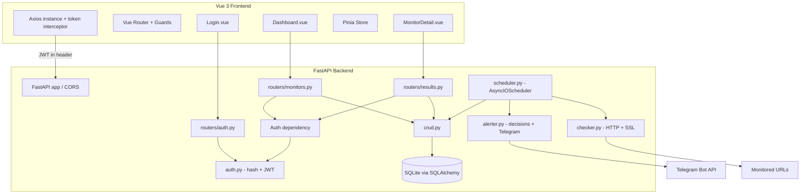
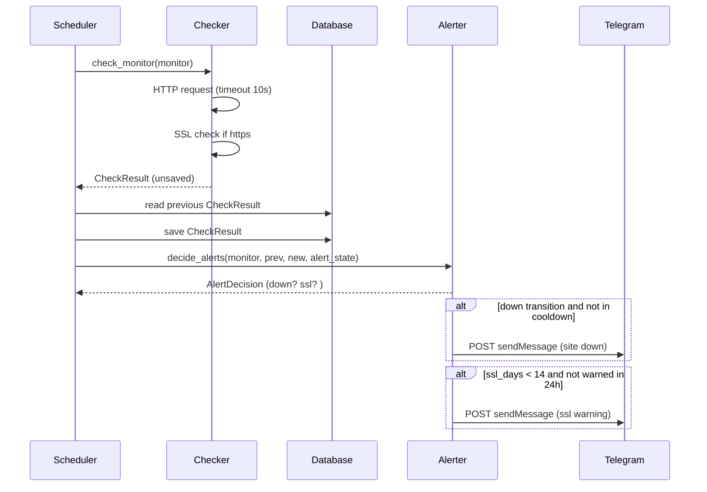

# Design Document: Uptime Guardian

## Overview

Uptime Guardian is a self-hosted website monitoring system split into a Python/FastAPI backend and a Vue 3 frontend. The backend polls configured URLs on per-monitor schedules, records HTTP and SSL check outcomes to SQLite, dispatches Telegram alerts on state transitions, and exposes a token-protected REST API. The frontend renders real-time and historical views and authenticates against the backend with a single-user login.

The design follows the fixed, non-negotiable stack and project layout from the project spec. It separates concerns into focused modules so that the scheduling, checking, alerting, persistence, and authentication responsibilities are independently testable. Pure logic (check classification, SSL day computation, statistics aggregation, alert-decision rules, password hashing, token issue/validate) is isolated from I/O so it can be exercised with property-based tests, while I/O boundaries (HTTP, SQLite, Telegram) are verified with example and integration tests.

### Key Design Decisions

- **Sync ORM, async checks**: SQLAlchemy is used synchronously for simplicity, while `httpx.AsyncClient` performs network checks. The scheduler is an `AsyncIOScheduler` running on the FastAPI event loop; blocking DB calls run inside async jobs but are short and local to SQLite, acceptable for an MVP. The rationale is to keep the data layer simple while retaining async timeout control on outbound checks.
- **Pure decision functions**: Alert-firing decisions (down transition, cooldown, SSL warning suppression) are computed by pure functions that take prior state and the new result and return a decision. This keeps the scheduler thin and the rules testable.
- **Stateless token auth**: A signed JWT (HS256) issued at login and validated via a FastAPI dependency protects all data routes. This avoids server-side session storage for a single-user MVP.
- **Statistics computed in SQL/Python over a window**: Aggregates are derived from `CheckResult` rows within a time window rather than maintained incrementally, trading a small query cost for correctness simplicity.

## Architecture

### Request and Polling Flows

## Components and Interfaces

### Backend Modules

**config.py** — `Settings(BaseSettings)` loaded from `.env` via pydantic-settings. Fields: `database_url`, `telegram_bot_token`, `telegram_chat_id`, `check_interval_minutes` (default 5), `alert_cooldown_minutes` (default 10), `auth_secret_key`. Validators coerce non-positive or non-integer interval/cooldown values to defaults. Required fields raise a startup configuration error when missing.

**database.py** — SQLAlchemy `engine`, `SessionLocal` factory, and declarative `Base`. Provides `get_db()` dependency and `init_db()` to create tables.

**models.py** — ORM models `Monitor`, `CheckResult`, and `User` (see Data Models).

**schemas.py** — Pydantic schemas for API I/O: `MonitorCreate`, `MonitorUpdate`, `MonitorOut`, `MonitorWithLatest`, `CheckResultOut`, `StatsOut`, `LoginRequest`, `TokenResponse`. `MonitorCreate`/`MonitorUpdate` validate URL format (pydantic `AnyHttpUrl`).

**checker.py** — `async def check_monitor(monitor: Monitor) -> CheckResult` and pure helpers:
- `classify_status(status_code: int | None) -> bool` returns `is_up` (True iff 200–299).
- `compute_ssl_days_remaining(not_after: datetime, now: datetime) -> int`.
- `perform_ssl_check(host: str, now: datetime) -> SslOutcome` (wraps socket/ssl, never raises).

**alerter.py** — Pure decision and formatting plus I/O dispatch:
- `decide_alerts(prev_is_up: bool | None, new_result: CheckResult, last_down_alert_at, last_ssl_alert_at, now, cooldown_minutes, notify_on_failure) -> AlertDecision`.
- `build_down_message(monitor, result) -> str` and `build_ssl_message(monitor, result) -> str` (HTML + emoji).
- `async def send_telegram_alert(message: str) -> None` (catches all exceptions, logs, never raises).

**auth.py** — Pure auth logic:
- `hash_password(plain: str) -> str` and `verify_password(plain: str, hashed: str) -> bool` (passlib bcrypt).
- `create_access_token(subject: str, now, expires_minutes, secret) -> str` and `decode_access_token(token: str, now, secret) -> str | None` (PyJWT HS256).
- `get_current_user` FastAPI dependency that returns 401 on missing/invalid/expired token.

**crud.py** — Read/write helpers: monitor CRUD, `create_check_result`, `get_latest_result`, `get_results(monitor_id, limit)`, `get_results_in_window(monitor_id, since)`, `compute_stats(results) -> StatsOut`, user lookup, seeding helpers.

**scheduler.py** — `AsyncIOScheduler` wrapper: `start()`, `shutdown()`, `register_monitor(monitor)`, `reload_scheduler()`, and `run_check(monitor_id)` job body that checks, persists, applies alert decisions, and updates in-memory alert state per monitor.

**main.py** — FastAPI app: CORS for `http://localhost:5173`; include routers `/api/auth`, `/api/monitors`, `/api/results`; startup runs `init_db()`, seeds data, starts scheduler; shutdown stops scheduler.

**routers/auth.py** — `POST /api/auth/login` accepts `LoginRequest`, returns `TokenResponse` on success, 401 on failure.

**routers/monitors.py** and **routers/results.py** — endpoints below; every route depends on `get_current_user`.

### API Endpoints (all data routes require a valid Auth_Token)

| Method | Path | Behavior |
|--------|------|----------|
| POST | /api/auth/login | Validate credentials, return JWT (200) or 401 |
| GET | /api/monitors | List monitors with latest result embedded |
| POST | /api/monitors | Create monitor (201); 422 invalid URL; 500 on persistence failure |
| GET | /api/monitors/{id} | Monitor + last 50 results; 404 if missing |
| PUT | /api/monitors/{id} | Update name, url, is_active, interval |
| DELETE | /api/monitors/{id} | Delete monitor and its results |
| POST | /api/monitors/{id}/check-now | Immediate check; persist result |
| GET | /api/results?monitor_id=&limit= | Recent results |
| GET | /api/results/stats?monitor_id=&hours= | Aggregate stats over window |

### Frontend Components

- **router/index.js** — routes for `/login`, `/` (Dashboard), `/monitors/:id` (MonitorDetail). A global `beforeEach` guard redirects to `/login` when no token is present in the store/localStorage.
- **api/index.js** — Axios instance with a request interceptor that attaches `Authorization: Bearer <token>`; a response interceptor that, on 401, clears the token and redirects to login.
- **stores/monitors.js** — Pinia store: `monitors[]`, `loading`, `error`; actions `fetchMonitors`, `addMonitor`, `deleteMonitor`, `triggerCheck`.
- **stores/auth.js** — token state, `login`, `logout`.
- **views/Login.vue** — minimalist dark-theme form (username, password), calls login, stores token, redirects to dashboard; shows error on 401.
- **views/Dashboard.vue** — header (app name, monitor count, global 24h uptime), responsive grid of `MonitorCard`, floating `+` button → `AddMonitorModal`, 30s polling via `setInterval`.
- **views/MonitorDetail.vue** — back button, monitor header, 24h stats row, `ResponseTimeChart`, table of last 50 results, "Check Now" button.
- **components/** — `MonitorCard.vue` (status badge, response time, SSL status, inline `UptimeBar`), `UptimeBar.vue` (30 blocks, up/down/no-data, tooltip), `ResponseTimeChart.vue` (vue-chartjs line chart, DOWN events as red dots), `AddMonitorModal.vue` (name, URL validated, interval dropdown 5/10/15/30).

## Data Models

### Monitor
| Field | Type | Notes |
|-------|------|-------|
| id | Integer | PK |
| name | String | |
| url | String | |
| is_active | Boolean | default True |
| check_interval_minutes | Integer | default 5 |
| created_at | DateTime | auto-set on create |
| notify_on_failure | Boolean | default True |

### CheckResult
| Field | Type | Notes |
|-------|------|-------|
| id | Integer | PK |
| monitor_id | Integer | FK → Monitor, cascade delete |
| checked_at | DateTime | auto-set |
| status_code | Integer or None | None = connection failure |
| response_time_ms | Float or None | |
| is_up | Boolean | True iff 200 ≤ status_code < 300 |
| ssl_valid | Boolean or None | None for non-HTTPS |
| ssl_days_remaining | Integer or None | None for non-HTTPS |
| error_message | String or None | |

### User
| Field | Type | Notes |
|-------|------|-------|
| id | Integer | PK |
| username | String | unique |
| hashed_password | String | bcrypt hash, never plaintext |

### Derived: StatsOut
`uptime_percentage`, `avg_response_time_ms`, `total_checks`, `failed_checks`, `min_response_time_ms`, `max_response_time_ms`. Computed over results in the requested window; all-zero when the window has no records.

### Derived: AlertDecision
`send_down: bool`, `send_ssl: bool` — outputs of the pure `decide_alerts` function consumed by the scheduler.

## Correctness Properties

*A property is a characteristic or behavior that should hold true across all valid executions of a system — essentially, a formal statement about what the system should do. Properties serve as the bridge between human-readable specifications and machine-verifiable correctness guarantees.*

The properties below were derived from the prework analysis. Criteria classified as EXAMPLE, EDGE_CASE, INTEGRATION, or SMOKE are covered in the Testing Strategy rather than as universal properties. Redundant criteria were consolidated: status classification (2.3, 2.4) into one property; down-alert gating (5.1, 5.3, 5.4) into one decision property; SSL-alert gating (6.1, 6.3) into one decision property; Telegram non-raising (5.5, 7.3) into one invariant; and token validity (12.5, 12.6) into one round-trip property.

### Property 1: Status code classification

*For any* integer status code, `classify_status` returns true if and only if the code is in the range 200 to 299 inclusive.

**Validates: Requirements 2.3, 2.4**

### Property 2: Request failures produce a failed result

*For any* exception raised by the HTTP transport, `check_monitor` produces a Check_Result with status_code null, is_up false, and a non-empty error_message.

**Validates: Requirements 2.5**

### Property 3: SSL days remaining computation

*For any* current time and any non-negative whole-day offset d, `compute_ssl_days_remaining(now + d days, now)` equals d, and the resulting outcome marks ssl_valid true when d is positive.

**Validates: Requirements 3.1, 3.2**

### Property 4: SSL failure is contained

*For any* SSL failure or invalid certificate, `perform_ssl_check` returns ssl_valid false and ssl_days_remaining 0 without raising, leaving the HTTP-derived fields of the Check_Result unchanged.

**Validates: Requirements 3.3**

### Property 5: Non-HTTPS monitors have null SSL fields

*For any* monitor URL whose scheme is not https, `check_monitor` sets ssl_valid and ssl_days_remaining to null.

**Validates: Requirements 3.4**

### Property 6: Down-alert decision

*For any* previous up state, new Check_Result, cooldown window, last-down-alert timestamp, and notify_on_failure flag, `decide_alerts` sets send_down true if and only if the previous state was up, the new result is down, notify_on_failure is true, and the last down alert is outside the cooldown window.

**Validates: Requirements 5.1, 5.3, 5.4**

### Property 7: Down-alert message content

*For any* monitor and failed Check_Result, `build_down_message` produces a string that contains the monitor name, the monitor URL, the status code, the check timestamp in UTC, and the error description.

**Validates: Requirements 5.2**

### Property 8: SSL-warning decision

*For any* Check_Result and last-SSL-alert timestamp, `decide_alerts` sets send_ssl true if and only if ssl_days_remaining is below 14 and the last SSL alert is more than 24 hours before now.

**Validates: Requirements 6.1, 6.3**

### Property 9: SSL-warning message content

*For any* monitor and Check_Result with low ssl_days_remaining, `build_ssl_message` produces a string that contains the monitor name, the number of days remaining, and the monitor URL.

**Validates: Requirements 6.2**

### Property 10: Telegram dispatch never raises

*For any* failure mode of the outbound request (connection error, timeout, malformed response, or arbitrary exception), `send_telegram_alert` returns without raising an exception to the caller.

**Validates: Requirements 5.5, 7.3**

### Property 11: Recent results query respects limit and ordering

*For any* set of Check_Result records and any positive limit, the recent-results query returns at most `limit` records, all belonging to the requested monitor, ordered from newest to oldest by checked_at.

**Validates: Requirements 8.1**

### Property 12: Statistics aggregation is consistent

*For any* non-empty set of Check_Result records in a window, `compute_stats` yields uptime_percentage equal to (count of is_up true / total_checks) × 100, with 0 ≤ uptime_percentage ≤ 100, total_checks equal to the record count, failed_checks equal to total_checks minus the up count, and min_response_time_ms ≤ avg_response_time_ms ≤ max_response_time_ms.

**Validates: Requirements 8.2, 8.3**

### Property 13: Cascade delete removes a monitor and its results

*For any* monitor with any number of associated Check_Result records, deleting the monitor leaves no monitor with that id and zero Check_Result records referencing that id.

**Validates: Requirements 1.7**

### Property 14: Seeding is idempotent

*For any* number of repeated seed invocations on an initially empty database, the database contains exactly the two example monitors (Google, GitHub) and exactly one admin user, with no duplicates.

**Validates: Requirements 10.3, 10.4**

### Property 15: Configuration falls back on invalid values

*For any* non-positive or non-integer value supplied for the check interval or alert cooldown, `Settings` yields the corresponding default (5 or 10).

**Validates: Requirements 9.4**

### Property 16: Password hashing round trip

*For any* password p, `verify_password(p, hash_password(p))` is true, the stored hash differs from p, and for any q not equal to p, `verify_password(q, hash_password(p))` is false.

**Validates: Requirements 12.3**

### Property 17: Invalid credentials are rejected

*For any* username/password pair that does not match the stored credentials, the login operation returns a 401 outcome and issues no Auth_Token.

**Validates: Requirements 12.2**

### Property 18: Protected endpoints reject missing tokens

*For any* protected endpoint, a request without a valid Auth_Token receives a 401 response and the requested operation is not performed.

**Validates: Requirements 12.4**

### Property 19: Token issue/validate round trip

*For any* subject, `decode_access_token(create_access_token(subject))` returns that subject when the token is fresh and unmodified, and returns null when the token signature is altered or its validity period has elapsed.

**Validates: Requirements 12.5, 12.6**

## Error Handling

- **Outbound checks (checker.py)**: All HTTP exceptions (`httpx.ConnectError`, `httpx.TimeoutException`, and any other) are caught; the Check_Result records status_code null, is_up false, and the exception text in error_message. The SSL check is wrapped so any failure yields (ssl_valid false, ssl_days_remaining 0) and never aborts the HTTP outcome.
- **Alert dispatch (alerter.py)**: `send_telegram_alert` catches every exception, logs it via the standard logging module, and returns normally. Alert failures never propagate into the scheduler or crash a check cycle.
- **API layer**: Invalid request bodies return 422 (FastAPI/pydantic). Missing resources return 404. Persistence failures are caught and returned as 500. Unauthorized requests return 401 from the auth dependency before any handler logic runs.
- **Configuration (config.py)**: Missing required settings (`telegram_bot_token`, `telegram_chat_id`, `auth_secret_key`) raise a configuration error at startup that identifies the missing field. Invalid interval/cooldown values fall back to defaults via validators.
- **Startup (main.py)**: If `init_db()` table creation fails, startup is halted and the failure is reported; the application does not serve requests on a broken schema.
- **Scheduler (scheduler.py)**: Each job body wraps its work so that an exception in one check is logged and does not stop the scheduler or other jobs.
- **Frontend**: Axios response interceptor surfaces API errors as toast notifications and preserves the last successfully loaded store state. A 401 response clears the token and redirects to the login view.

## Testing Strategy

### Dual Approach

Property-based tests verify the universal properties above across many generated inputs. Example, edge-case, integration, and smoke tests cover concrete behaviors, wiring, and configuration that do not benefit from randomized input. Property-based testing applies here because the core logic (status classification, SSL day math, statistics aggregation, alert decisions, hashing, token round trips) consists of pure functions with large input spaces.

### Property-Based Testing

- **Library**: `hypothesis` for the Python backend.
- **Iterations**: Each property test runs a minimum of 100 generated examples.
- **Tagging**: Each property test is annotated with a comment in the form
  `# Feature: uptime-guardian, Property {number}: {property_text}`.
- **Mapping**: Each of Properties 1–19 is implemented by exactly one property-based test. Network, Telegram, and DB I/O are replaced with in-memory fakes/mocks (in-memory SQLite, fake httpx transport) so properties test logic cheaply.

### Example, Edge-Case, Integration, and Smoke Tests

- **API examples (1.1–1.6, 4.5, 7.1, 9.2, 9.3, 10.2, 12.1)**: FastAPI `TestClient` tests for create/read/update/check-now, status codes (201/404/422/500), login success, config defaults/errors, and Telegram request shape (mocked transport).
- **Edge cases (1.2, 8.4)**: Parametrized malformed URLs assert 422; `compute_stats([])` returns all-zero values without error.
- **Integration (4.1, 4.3, 10.5)**: Start the scheduler against seeded monitors and assert one job per active monitor, that adding a monitor registers a job via `reload_scheduler()`, and that shutdown stops jobs.
- **Smoke (2.1, 4.4, 7.2, 9.1, 10.1)**: Assert the httpx client timeout is 10.0, the scheduler is an `AsyncIOScheduler` with coroutine jobs, settings are read from `.env`, and `init_db()` creates tables.
- **Frontend component tests (11.1–11.9)**: Vitest + Vue Test Utils with a mocked store/router/Axios for card rendering, uptime bar blocks, 30s polling (fake timers), navigation, add-monitor submit, error handling, the router guard redirect, and the Authorization header interceptor.

### Test Organization

Backend tests live under `backend/tests/` split into `test_properties.py` (Properties 1–19), `test_api.py`, `test_scheduler.py`, and `test_config.py`. Frontend tests live alongside components under `frontend/src/**/__tests__/`.
