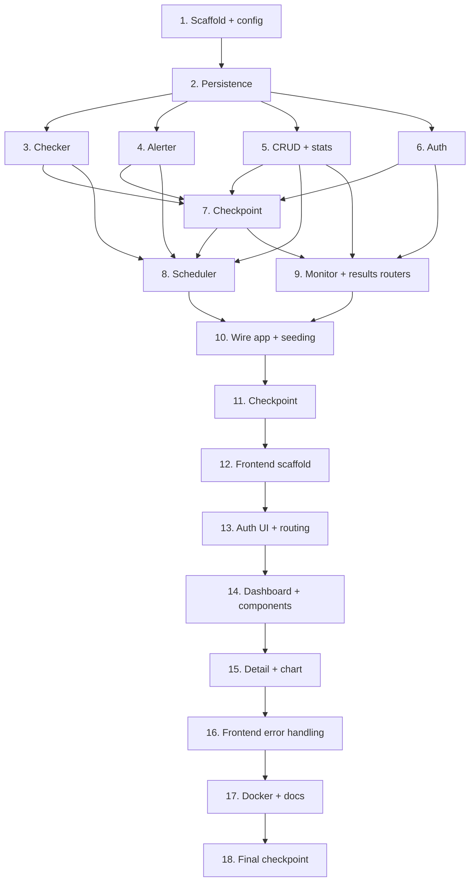

# Implementation Plan: Uptime Guardian

## Overview

This plan builds the backend first (config, persistence, pure logic, scheduler, API, auth), then the Vue frontend, then polish (Docker, README). Each step builds on the previous and ends by wiring components together so no code is left orphaned. Property tests (Hypothesis) and unit/component tests are sub-tasks placed next to the code they validate. Tasks marked with `*` are optional test tasks.

## Tasks

- [x] 1. Scaffold backend project and configuration
  - Create `backend/` package layout (`main.py`, `routers/`) and `requirements.txt` (fastapi, uvicorn, sqlalchemy, httpx, apscheduler, pydantic-settings, passlib[bcrypt], pyjwt, hypothesis, pytest)
  - Implement `config.py` `Settings(BaseSettings)` loading DATABASE_URL, TELEGRAM_BOT_TOKEN, TELEGRAM_CHAT_ID, CHECK_INTERVAL_MINUTES (default 5), ALERT_COOLDOWN_MINUTES (default 10), AUTH_SECRET_KEY; raise a startup config error for missing required fields
  - Add validators that coerce non-positive/non-integer interval and cooldown values to defaults
  - Create `.env.example` with all keys
  - _Requirements: 9.1, 9.2, 9.3_

  - [ ]* 1.1 Write property test for config fallback
    - **Property 15: Configuration falls back on invalid values**
    - **Validates: Requirements 9.4**

  - [ ]* 1.2 Write unit tests for settings loading and missing-field errors
    - Test defaults applied and required-field error identifies the missing key
    - _Requirements: 9.1, 9.2, 9.3_

- [x] 2. Implement persistence layer
  - [x] 2.1 Implement `database.py` (engine, SessionLocal, Base, `get_db`, `init_db`)
    - _Requirements: 10.1_

  - [x] 2.2 Implement `models.py` ORM models `Monitor`, `CheckResult` (FK with cascade delete), `User`
    - Use type hints; set auto timestamps and column defaults per design
    - _Requirements: 1.1, 1.7, 10.1_

  - [x] 2.3 Implement `schemas.py` Pydantic schemas (MonitorCreate/Update/Out, MonitorWithLatest, CheckResultOut, StatsOut, LoginRequest, TokenResponse) with URL validation
    - _Requirements: 1.1, 1.2, 8.2, 12.1_

- [x] 3. Implement core checker logic
  - [x] 3.1 Implement pure helpers in `checker.py`: `classify_status`, `compute_ssl_days_remaining`, `perform_ssl_check`
    - SSL helper wraps socket/ssl and never raises; returns (ssl_valid, ssl_days_remaining)
    - _Requirements: 2.3, 2.4, 3.1, 3.2, 3.3_

  - [ ]* 3.2 Write property test for status classification
    - **Property 1: Status code classification**
    - **Validates: Requirements 2.3, 2.4**

  - [ ]* 3.3 Write property test for SSL day computation
    - **Property 3: SSL days remaining computation**
    - **Validates: Requirements 3.1, 3.2**

  - [ ]* 3.4 Write property test for SSL failure containment
    - **Property 4: SSL failure is contained**
    - **Validates: Requirements 3.3**

  - [x] 3.5 Implement `async def check_monitor(monitor) -> CheckResult` using `httpx.AsyncClient` (timeout 10.0)
    - Record response_time_ms; catch all request exceptions (status_code None, is_up False, error_message set); invoke SSL helper only for https; set ssl fields null for non-https; return unsaved CheckResult
    - _Requirements: 2.1, 2.2, 2.5, 2.6, 3.4_

  - [ ]* 3.6 Write property tests for check failure and non-https SSL fields
    - **Property 2: Request failures produce a failed result**
    - **Property 5: Non-HTTPS monitors have null SSL fields**
    - **Validates: Requirements 2.5, 3.4**

  - [ ]* 3.7 Write unit/smoke tests for checker
    - Assert client timeout 10.0; response_time_ms recorded and non-negative with a fake transport; returned result is unsaved
    - _Requirements: 2.1, 2.2, 2.6_

- [x] 4. Implement alert logic and Telegram dispatch
  - [x] 4.1 Implement pure `decide_alerts` and message builders `build_down_message`, `build_ssl_message` in `alerter.py`
    - decide_alerts gates send_down on up→down transition, notify_on_failure, and cooldown; gates send_ssl on days<14 and 24h suppression using absolute timestamps
    - _Requirements: 5.1, 5.2, 5.3, 5.4, 6.1, 6.2, 6.3_

  - [ ]* 4.2 Write property test for down-alert decision
    - **Property 6: Down-alert decision**
    - **Validates: Requirements 5.1, 5.3, 5.4**

  - [ ]* 4.3 Write property test for SSL-warning decision
    - **Property 8: SSL-warning decision**
    - **Validates: Requirements 6.1, 6.3**

  - [ ]* 4.4 Write property tests for message content
    - **Property 7: Down-alert message content**
    - **Property 9: SSL-warning message content**
    - **Validates: Requirements 5.2, 6.2**

  - [x] 4.5 Implement `async def send_telegram_alert(message)` using httpx POST to sendMessage with chat_id, text, parse_mode HTML
    - Read token/chat id from Settings; catch all exceptions, log, never raise
    - _Requirements: 7.1, 7.2, 7.3, 5.5_

  - [ ]* 4.6 Write property test for dispatch safety
    - **Property 10: Telegram dispatch never raises**
    - **Validates: Requirements 5.5, 7.3**

  - [ ]* 4.7 Write unit test for Telegram request shape
    - Mock httpx; assert URL contains bot token and body has chat_id/text/parse_mode HTML
    - _Requirements: 7.1, 7.2_

- [x] 5. Implement CRUD and statistics helpers
  - [x] 5.1 Implement `crud.py`: monitor CRUD, `create_check_result`, `get_latest_result`, `get_results(monitor_id, limit)`, `get_results_in_window`, `compute_stats`, user lookup, seeding helpers
    - Cascade delete removes a monitor and its results; recent-results query orders newest-first and respects limit
    - _Requirements: 1.3, 1.4, 1.6, 1.7, 8.1, 8.2, 8.3, 8.4_

  - [ ]* 5.2 Write property test for cascade delete
    - **Property 13: Cascade delete removes a monitor and its results**
    - **Validates: Requirements 1.7**

  - [ ]* 5.3 Write property test for recent-results query
    - **Property 11: Recent results query respects limit and ordering**
    - **Validates: Requirements 8.1**

  - [ ]* 5.4 Write property test for statistics aggregation
    - **Property 12: Statistics aggregation is consistent**
    - **Validates: Requirements 8.2, 8.3**

  - [ ]* 5.5 Write edge-case test for empty stats window
    - `compute_stats([])` returns all-zero values without error
    - _Requirements: 8.4_

- [x] 6. Implement authentication
  - [x] 6.1 Implement `auth.py`: `hash_password`, `verify_password` (bcrypt), `create_access_token`, `decode_access_token` (HS256), and `get_current_user` dependency returning 401 on missing/invalid/expired token
    - _Requirements: 12.3, 12.4, 12.5, 12.6_

  - [ ]* 6.2 Write property test for password hashing round trip
    - **Property 16: Password hashing round trip**
    - **Validates: Requirements 12.3**

  - [ ]* 6.3 Write property test for token issue/validate round trip
    - **Property 19: Token issue/validate round trip**
    - **Validates: Requirements 12.5, 12.6**

  - [x] 6.4 Implement `routers/auth.py` `POST /api/auth/login` returning a token (200) or 401
    - _Requirements: 12.1, 12.2_

  - [ ]* 6.5 Write property tests for login and protected access
    - **Property 17: Invalid credentials are rejected**
    - **Property 18: Protected endpoints reject missing tokens**
    - **Validates: Requirements 12.2, 12.4**

- [x] 7. Checkpoint - Ensure all backend logic tests pass
  - Ensure all tests pass, ask the user if questions arise.

- [x] 8. Implement scheduler
  - [x] 8.1 Implement `scheduler.py` `AsyncIOScheduler` wrapper: `start`, `shutdown`, `register_monitor`, `reload_scheduler`, and a `run_check(monitor_id)` job body
    - Job body checks, persists result, reads previous result, applies `decide_alerts`, dispatches alerts, and updates per-monitor alert state; jobs are coroutines so the event loop is not blocked; per-job try/except isolates failures
    - _Requirements: 4.1, 4.2, 4.3, 4.4, 5.1, 6.1_

  - [ ]* 8.2 Write integration tests for scheduler
    - Assert one job per active monitor on start, `reload_scheduler` registers a new monitor's job, shutdown stops jobs, jobs are coroutines
    - _Requirements: 4.1, 4.3, 4.4, 10.5_

- [x] 9. Implement monitor and results routers
  - [x] 9.1 Implement `routers/monitors.py`: GET (list + latest embedded), POST (201; 422 invalid URL; 500 on persistence failure), GET/{id} (404 if missing), PUT/{id}, DELETE/{id}, POST/{id}/check-now; all depend on `get_current_user`
    - check-now triggers an immediate check and persists the result
    - _Requirements: 1.1, 1.2, 1.3, 1.4, 1.5, 1.6, 1.7, 4.5, 12.4, 12.5_

  - [x] 9.2 Implement `routers/results.py`: GET (recent by monitor_id + limit) and GET /stats (window in hours); all depend on `get_current_user`
    - _Requirements: 8.1, 8.2, 8.3, 8.4, 12.4_

  - [ ]* 9.3 Write API tests for monitor and results endpoints
    - Cover 201/404/422/500, list-with-latest, update, delete, check-now, results, stats, and 401 without token
    - _Requirements: 1.1, 1.2, 1.3, 1.4, 1.5, 1.6, 4.5, 8.1, 8.2, 12.4_

- [x] 10. Wire FastAPI app, lifecycle, and seeding
  - [x] 10.1 Implement `main.py`: create app, enable CORS for http://localhost:5173, include `/api/auth`, `/api/monitors`, `/api/results` routers
    - _Requirements: 1.1, 8.1, 12.1_

  - [x] 10.2 Implement startup/shutdown: run `init_db()` (halt startup on failure), seed two example monitors and the admin user when their tables are empty, start scheduler on startup, stop scheduler on shutdown
    - _Requirements: 10.1, 10.2, 10.3, 10.4, 10.5_

  - [ ]* 10.3 Write property test for seeding idempotence
    - **Property 14: Seeding is idempotent**
    - **Validates: Requirements 10.3, 10.4**

  - [ ]* 10.4 Write unit/smoke tests for lifecycle
    - Assert tables created, startup halts when create_all raises, scheduler started/stopped
    - _Requirements: 10.1, 10.2, 10.5_

- [x] 11. Checkpoint - Ensure all backend tests pass
  - Ensure all tests pass, ask the user if questions arise.

- [x] 12. Scaffold frontend project
  - Initialize Vue 3 + Vite + TailwindCSS + Pinia + vue-router + vue-chartjs via pnpm; configure dark theme tokens (bg #0a0f1e, up #00d4aa, down #ff4757), JetBrains Mono + Inter fonts
  - Implement `api/index.js` Axios instance with request interceptor attaching `Authorization: Bearer <token>` and response interceptor handling 401 (clear token, redirect to login)
  - _Requirements: 11.9_

  - [ ]* 12.1 Write unit test for Axios token interceptor
    - Assert Authorization header attached when token set
    - _Requirements: 11.9_

- [x] 13. Implement auth UI and routing
  - [x] 13.1 Implement `stores/auth.js` (token state, login, logout) and `router/index.js` with routes (/login, /, /monitors/:id) and a `beforeEach` guard redirecting to /login when no token
    - _Requirements: 11.8_

  - [x] 13.2 Implement `views/Login.vue` minimalist dark-theme form calling login, storing token, redirecting on success, showing error on 401
    - _Requirements: 12.1, 11.8_

  - [ ]* 13.3 Write component tests for guard and login
    - Assert redirect to /login without token; login stores token and navigates
    - _Requirements: 11.8, 12.1_

- [x] 14. Implement dashboard and monitor components
  - [x] 14.1 Implement `stores/monitors.js` (monitors, loading, error; fetchMonitors, addMonitor, deleteMonitor, triggerCheck)
    - _Requirements: 1.3, 1.1, 1.7, 4.5_

  - [x] 14.2 Implement `views/Dashboard.vue`: header (app name, monitor count, global 24h uptime), responsive grid, floating + button, 30s polling via setInterval
    - _Requirements: 11.1, 11.3_

  - [x] 14.3 Implement `components/MonitorCard.vue` and `components/UptimeBar.vue`
    - Card shows name, URL, up/down badge, response time, SSL status, inline uptime bar; bar renders 30 blocks (up/down/no-data) with tooltips; clicking navigates to detail
    - _Requirements: 11.2, 11.4, 11.5_

  - [x] 14.4 Implement `components/AddMonitorModal.vue` (name, validated URL, interval dropdown 5/10/15/30) submitting POST and refreshing on success
    - _Requirements: 11.6, 1.1_

  - [ ]* 14.5 Write component tests for dashboard and cards
    - Cover count/uptime render, 30s polling (fake timers), card fields, uptime bar blocks, navigation, add-monitor submit
    - _Requirements: 11.1, 11.2, 11.3, 11.4, 11.5, 11.6_

- [x] 15. Implement monitor detail and chart
  - [x] 15.1 Implement `views/MonitorDetail.vue`: back button, monitor header, 24h stats row, results table (last 50), and a Check Now button calling triggerCheck
    - _Requirements: 11.5, 8.1, 8.2, 4.5_

  - [x] 15.2 Implement `components/ResponseTimeChart.vue` (vue-chartjs line chart, time vs response_time_ms, area gradient, DOWN events as red dots)
    - _Requirements: 11.5_

  - [ ]* 15.3 Write component test for detail view
    - Assert stats row, table rows, and Check Now triggers an API call
    - _Requirements: 11.5, 4.5_

- [x] 16. Implement frontend error handling
  - Wire error toasts on API errors and loading skeletons on MonitorCard; ensure last successfully loaded data is preserved on error
  - _Requirements: 11.7_

  - [ ]* 16.1 Write component test for API error handling
    - Force an API error; assert error indication shown and prior data intact
    - _Requirements: 11.7_

- [x] 17. Add Docker and project documentation
  - Add `backend/Dockerfile` and `frontend/Dockerfile`; create `docker-compose.yml` (backend build ./backend port 8000, frontend build ./frontend port 3000, env_file .env, named volume sqlite_data, frontend depends_on backend)
  - Write `README.md` (what it is, features, prerequisites incl. BotFather setup, step-by-step local setup for backend and frontend, adding the first monitor via UI, Docker Compose run)
  - _Requirements: 9.1, 10.1_

- [x] 18. Final checkpoint - Ensure all tests pass
  - Ensure all tests pass, ask the user if questions arise.

## Task Dependency Graph



```json
{
  "waves": [
    { "wave": 1, "tasks": ["1"] },
    { "wave": 2, "tasks": ["2"] },
    { "wave": 3, "tasks": ["3", "4", "5", "6"] },
    { "wave": 4, "tasks": ["7"] },
    { "wave": 5, "tasks": ["8", "9"] },
    { "wave": 6, "tasks": ["10"] },
    { "wave": 7, "tasks": ["11"] },
    { "wave": 8, "tasks": ["12"] },
    { "wave": 9, "tasks": ["13"] },
    { "wave": 10, "tasks": ["14"] },
    { "wave": 11, "tasks": ["15"] },
    { "wave": 12, "tasks": ["16"] },
    { "wave": 13, "tasks": ["17"] },
    { "wave": 14, "tasks": ["18"] }
  ]
}
```

## Notes

- Tasks marked with `*` are optional test tasks and can be skipped for a faster MVP.
- Each task references specific requirement sub-clauses for traceability.
- Property tests use Hypothesis with a minimum of 100 iterations and are tagged `# Feature: uptime-guardian, Property {n}: ...`.
- Checkpoints provide incremental validation between major phases.
